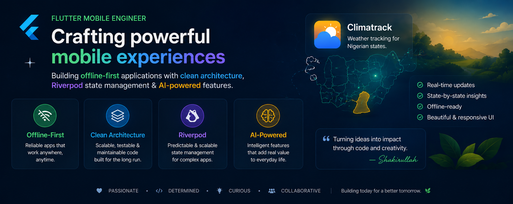

  

# Hi there, I'm Shakirullah Omotoso 👋

### 📱 Mobile Application Developer | Specialist in Flutter & Dart

I am a software engineer dedicated to architecting high-performance, responsive, and robust mobile applications. My technical focus centers on building offline-first systems, clean state-driven presentation layers, and seamless backend integrations.

- 🛠️ **Current Focus:** Developing **SewSafe** — a local-first, offline-capable application that helps fashion designers digitally document their customers' measurements without the fear of losing data.
- 🏗️ **Architecture Philosophy:** Emphasizing Clean Architecture, strict separation of concerns, and reusable component design optimized for senior developer code review cycles.
- 🤝 **Community Engagement:** Active volunteer and contributor assisting with community event coordination for Google Developer Groups on Campus (GDGoC).

---

## 🚀 Technical Arsenal

### 💻 Languages & Core Frameworks

### 🗄️ Backend, BaaS & Databases

### 🏗️ State Management & Data Architecture
- **State Management:** Riverpod (AsyncNotifier, StateNotifier, AsyncValue implementation architectures)
- **Data Layer & Storage:** Hive, SQLite, local caching mechanisms, and offline-first data sync strategies
- **Backend & DevOps:** Supabase (Auth configuration, Custom SMTP relays via Resend, custom URL scheme deep linking), Firebase Firestore, Custom REST API Integration.

---

## 🧰 Featured Projects

### 💊 [DoseVault](https://github.com/Shakirullah-builds/dose_vault)
*A secure, offline-first health companion application designed to manage daily medications, generate PDF history exports, and provide swipe-proof missed dose alerts.*
- **Technical Highlights:** Implemented robust background notification architecture for offline-first alerts, engineered PDF generation for medical data sharing, and integrated secure, anonymous sync options to protect user privacy.
- **Architecture:** Clean presentation states optimized for accessibility and strict data security.

### 🧵 [SewSafe](https://github.com/Shakirullah-builds/sewsafe_mobile)
*A local-first digital vault that helps fashion designers digitally document their customers' measurements without the fear of losing data.*
- **Technical Highlights:** Implemented Riverpod for asynchronous state handling and dynamic form validations. Configured custom URL deep linking (`sewsafe://login`) integrated with Supabase and Resend SMTP servers.
- **Architecture:** Clean Architecture with robust decoupled layout blocks.

### 🌾 [Agrilo](https://github.com/Shakirullah-builds/cavista-agrilo-mobile)
*An AI-powered crop disease detection system built as a native mobile agricultural solution.*
- **Technical Highlights:** Engineered responsive UI layouts and used TensorFlow Lite for handling AI models on-device. Implemented communication between the frontend and backend to deliver AI responses to the user interface, allowing users to seamlessly read and understand the detected diseases. 
- **Architecture:** Structured deep folder organization built to meet rigorous production-level repository standards.

---

## 📊 GitHub Performance Metrics

  
  

---

## 📬 Connect With Me

- 💼 **LinkedIn:** [/in/shakirullah-omotoso](https://www.linkedin.com/in/shakirullah-omotoso-7a8846347)
- 📧 **Email:** [saotech.dev@gmail.com](mailto:saotech.dev@gmail.com)
